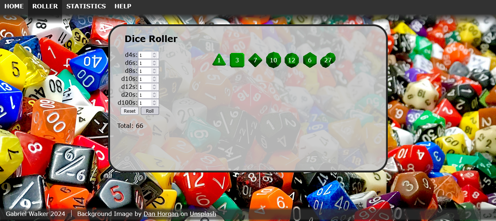
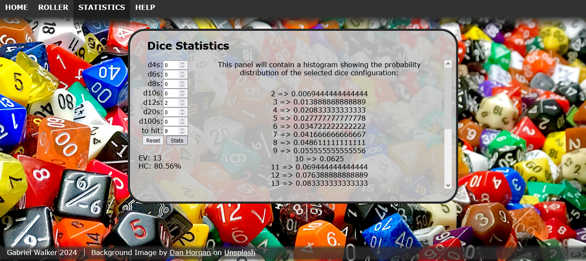

New Features:
Accounts - Create, delete, login, logout, handled asynchronously with AJAX and mysqli.
Saved Rolls (in progress) - If logged in, user can save and load dice rolls.
Asynchronous Form Submission (will be done next) - Code has been refactored to allow asynchronous form submission without a page reload every time.

ABOUT:
DiceApp is a free web-based dice roller for tabletop games. It also contains functionality for viewing statistics of dice configurations.

Dice Roller:
Roll up to 10 each of 4-, 6-, 8-, 10-, 12-, 20-, or 100-sided dice. Each roll and the total of all rolls will be displayed.

Dice Statistics (incomplete):
Select up to 10 each of 4-, 6-, 8-, 10-, 12-, 20-, or 100-sided dice. If desired, select a minimum roll to hit. The probability of each possible roll, the expected value, and the hit chance will be displayed.

